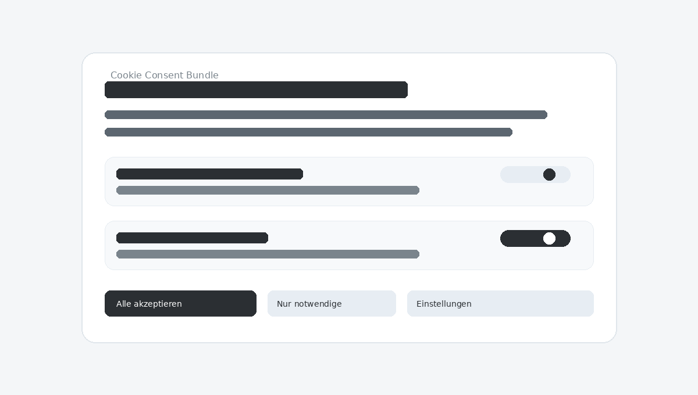

# Cookie Consent Bundle

[](https://packagist.org/packages/jostkleigrewe/cookie-consent-bundle)
[](https://packagist.org/packages/jostkleigrewe/cookie-consent-bundle)
[](https://github.com/jostkleigrewe/cookie-consent-bundle/actions/workflows/ci.yml)
[](https://github.com/jostkleigrewe/cookie-consent-bundle/releases)
[](LICENSE)

Ein Symfony 8 Bundle für DSGVO-konforme Cookie-Einwilligung mit Twig-Integration, Stimulus.js und flexiblen Speicher-Backends.

**[English Version](README.md)**

## Warum dieses Bundle?

- ✅ Symfony-native Einbindung mit Twig, Stimulus und AssetMapper
- ✅ Vendor-Ebene + Consent Mode v2 für moderne Ad-Stacks
- ✅ Session-sicher: verhindert unerwünschte Session-Cookies

## Screenshot



## Features

- 🎯 **DSGVO-konform** - Cookie-Einwilligung mit Richtlinien-Versionierung und Audit-Logging
- 🎨 **Mehrere Themes** - Tabler (hell/dunkel), Bootstrap oder eigene Templates
- ⚡ **Stimulus.js** - Turbo-kompatibel, kein vollständiger Seiten-Reload nötig
- 🧭 **Flexible Speicherung** - Cookie, Doctrine oder beides kombiniert
- 🧩 **Vendor-Ebene** - Optionale Vendor-Toggles innerhalb von Kategorien
- 🛡️ **Session-Schutz** - Verhindert Session-Cookies ohne Einwilligung
- 📊 **Google Consent Mode v2** - Integrierte GA4- und Google Ads-Unterstützung
- 🎬 **Embed-Komponenten** - YouTube, Vimeo, Google Maps u.v.m. mit Consent-Gates
- 🧪 **Twig-Helfer** - `cookie_consent_has()`, `cookie_consent_modal()` und mehr

## Voraussetzungen

- PHP 8.4+
- Symfony 8.0+
- Twig Bundle, Security Bundle, Stimulus Bundle
- Doctrine ORM + DoctrineBundle (optional, nur für `storage: doctrine|both`)

## Schnellstart

### 1. Installation

```bash
composer require jostkleigrewe/cookie-consent-bundle
```

### 2. Assets konfigurieren

```javascript
// assets/app.js
import '@jostkleigrewe/cookie-consent-bundle/styles/cookie_consent.css';
```

```json
// assets/controllers.json
{
  "controllers": {
    "@jostkleigrewe/cookie-consent-bundle": {
      "cookie-consent": { "enabled": true, "fetch": "eager" }
    }
  }
}
```

### 3. Modal einbinden

```twig
{# templates/base.html.twig #}
{{ cookie_consent_modal() }}
```

### 4. Inhalte nach Einwilligung steuern

```twig

  <script src="https://example.com/analytics.js"></script>

```

Oder mit Lazy Loading:

```html
<script type="text/plain" data-consent-category="analytics"
        data-consent-src="https://example.com/analytics.js"></script>
```

## Konfiguration

Erstelle `config/packages/cookie_consent.yaml`:

```yaml
cookie_consent:
  policy_version: '1'
  storage: cookie  # cookie, doctrine oder both

  categories:
    necessary:
      label: Notwendig
      required: true
      default: true
    analytics:
      label: Analyse
      default: false
    marketing:
      label: Marketing
      default: false
      vendors:
        google_ads:
          label: Google Ads
          default: false

  ui:
    template: '@CookieConsent/styles/tabler/modal.html.twig'
    position: center
    privacy_url: '/datenschutz'
    reload_on_change: false

  logging:
    retention_days: null

  google_consent_mode:
    enabled: false
```

Wenn `storage` auf `doctrine` oder `both` steht, erstelle die Migrationen in der App (das Bundle liefert Entities, keine Migrationen). Das erfordert Doctrine ORM:

```bash
bin/console doctrine:migrations:diff
bin/console doctrine:migrations:migrate
```

Erhöhe `policy_version` bei Änderungen an den Kategorien, um eine erneute Einwilligung zu erzwingen.

## Dokumentation

- **[Erste Schritte](docs/getting-started.de.md)** - Installation, Assets, erste Schritte
- **[Konfiguration](docs/configuration.de.md)** - Alle Optionen, Templates, Twig-Helfer
- **[Erweitert](docs/advanced.de.md)** - Speicher-Backends, Session-Erzwingung, Logging, Events
- **[Integration](docs/integration.de.md)** - Komponenten, Helper, Attribute, Data-Attributes, Events
- **[Changelog](CHANGELOG.md)** - Releases und Änderungen
- **[Contributing](CONTRIBUTING.de.md)** - Entwicklungsablauf und Guidelines

## Embed-Komponenten

Drittanbieter-Inhalte mit integrierten Komponenten absichern:

```twig
<twig:CookieConsentYoutubeEmbed
  video_id="dQw4w9WgXcQ"
  category="marketing"
  vendor="youtube"
/>
```

Alternative:

```twig
{{ component('CookieConsentYoutubeEmbed', {
  video_id: 'dQw4w9WgXcQ',
  category: 'marketing',
  vendor: 'youtube'
}) }}
```

Verfügbar: YouTube, Vimeo, Google Maps, Spotify, Twitter/X, Instagram, TikTok und mehr.

## Integrationsübersicht

Siehe **[Integration](docs/integration.de.md)** für Komponenten, Helper, Data-Attributes, Controller-Attribute und Events.

## Entwicklung

```bash
composer install
composer ci
```

## Lizenz

MIT - siehe [LICENSE](LICENSE).

## Ressourcen

- [Packagist](https://packagist.org/packages/jostkleigrewe/cookie-consent-bundle)
- [GitHub](https://github.com/jostkleigrewe/cookie-consent-bundle)
- [Issues melden](https://github.com/jostkleigrewe/cookie-consent-bundle/issues)
